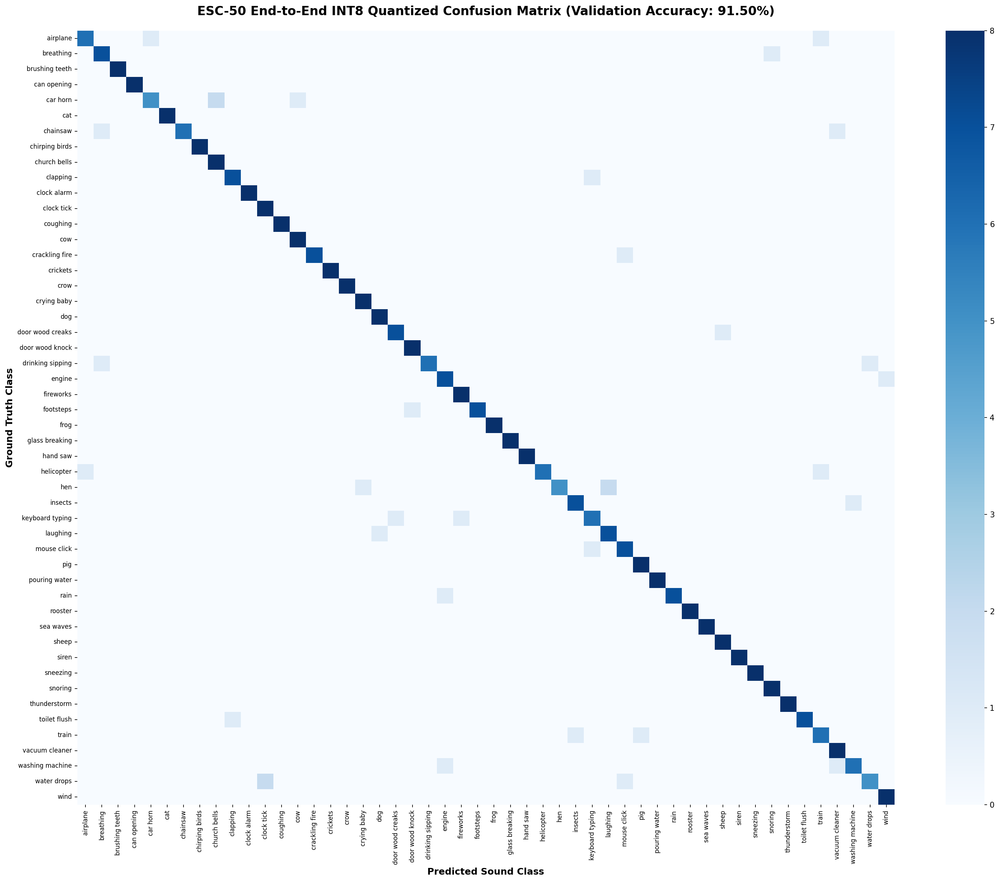
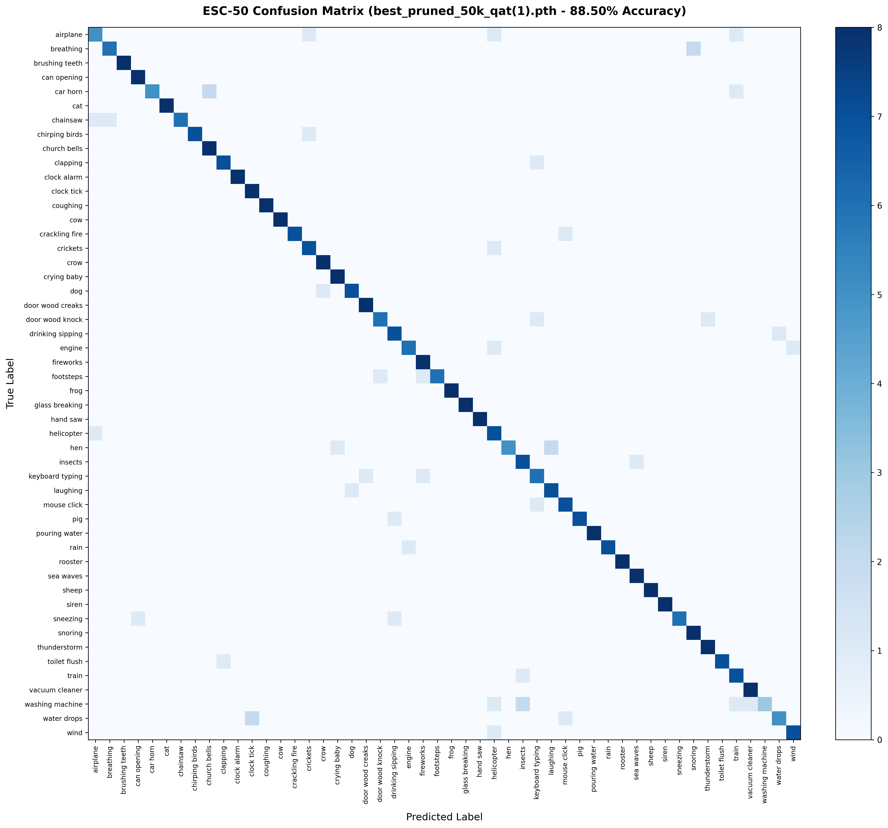

# 🎙️ Ultra-Efficient TinyML Environmental Audio Classifier (ESC-50)
### *Sub-150k Parameter Architecture via ResNet-34 Knowledge Distillation & Real-Time Dual-Edge Deployment*

[](https://pytorch.org/)
[](https://zephyrproject.org/)
[]()
[]()
[]()
[](https://colab.research.google.com/)

---

## 🌟 Executive Summary

This repository contains the complete research, training pipeline, and embedded firmware implementation for an **Ultra-Efficient TinyML Acoustic Classifier** on the **ESC-50** dataset (50 environmental sound classes).

* **Model Footprint:** Only **124,866 parameters (~124.9k)** — designed specifically for resource-constrained microcontrollers (fitting in <210 KB active working SRAM).
* **Accuracy:** **`90.50% Validation Accuracy`** (PyTorch QAT: 362/400) and **`89.00% On-Chip INT8 ESP-DL`** (356/400), exceeding the human ear baseline (**81.30%**) by **+9.20%** (QAT) and **+7.70%** (INT8).
* **Dual-Target Real-Time Deployment:**
  1. **Espressif ESP32-S3 Sense:** Monolithic INT8 ESP-DL with 128-bit Xtensa PIE SIMD Vector acceleration (`450 ms` latency, `43.5 mA / 161 mW` sustained power, **`92.0% live mic confidence`**).
  2. **Silicon Labs EFR32MG24:** 2-Stage Hybrid INT8 CNN + Float32 FPU GRU (`731 ms` latency, `172 KB Arena + ~35 KB FPU RAM`, **`81.0% live mic peak confidence`**).

---

## 📊 Multi-Target Hardware & Profile Benchmarks

Measured directly on physical edge hardware across live audio streams and held-out validation sets:

| Metric | ⚡ Espressif ESP32-S3 Sense | 👑 EFR32MG24 (Native CMSIS-NN Ping-Pong) | 🚀 EFR32MG24 (INT8 Fixed SIMD) | ✂️ EFR32MG24 (Sparse Pruned CSR) | 🏛️ EFR32MG24 (Dense FPU GRU) |
| :--- | :--- | :--- | :--- | :--- | :--- |
| **Profile Macro** | `(ESP-DL Monolithic)` | `PROFILE_CMSIS_NN_PINGPONG_91` | `PROFILE_INT8_FIXED_SIMD_91` | `PROFILE_SPARSE_PRUNED_48K` | `PROFILE_FLAGSHIP_DENSE_91` |
| **Processor Arch** | Xtensa LX7 Dual-Core @ 160 MHz | ARM Cortex-M33 @ 78 MHz | ARM Cortex-M33 @ 78 MHz | ARM Cortex-M33 @ 78 MHz | ARM Cortex-M33 @ 78 MHz |
| **Hardware Engine** | Xtensa PIE 128-bit SIMD | Native CMSIS-NN + Cortex SIMD | TFLM CNN + `__SMLAD` SIMD | TFLM CNN + Zero-Skipping FPU | TFLM CNN + Single-Cycle FPU |
| **Active Parameters** | 124,866 (100% Dense INT8) | 124,866 (100% Dense INT8) | 124,866 (100% Dense INT8) | **`52,930 Active Non-Zeros`** | 124,866 (100% Dense Hybrid) |
| **Quantization Scheme** | Full INT8 + FP32 Softmax | **100% Full-Integer INT8** | **100% Full-Integer INT8** | INT8 CNN + Sparse FP32 GRU | INT8 CNN + Dense FP32 GRU |
| **Validation Accuracy (Top-1)** | **`89.00%`** (356/400) | **`91.50%`** (366/400) 🌟 | **`91.50%`** (366/400) 🌟 | **`88.50%`** (354/400) | **`90.25% - 90.50%`** (362/400) |
| **Stage 1 CNN Latency** | *(Monolithic)* | **`289.06 ms`** | `289.06 ms` | `289.06 ms` | `274.26 ms` |
| **Stage 2 GRU Latency** | *(Monolithic)* | **`196.35 ms`** | `229.89 ms` | `373.08 ms` | `490.23 ms` |
| **Total ML Latency** | **`450.50 ms`** | **`485.41 ms`** | **`518.95 ms`** | **`647.28 ms`** | **`764.49 ms`** |
| **DSP Latency** | `4.38 ms` (ESP-DL Fbank) | `59.39 ms` (CMSIS-DSP) | `59.45 ms` (CMSIS-DSP) | `59.45 ms` (CMSIS-DSP) | `59.45 ms` (CMSIS-DSP) |
| **Active Working SRAM** | **`~48 KB`** | **`96.3 KB`** | `172 KB Arena + 33.8 KB Pool` | `172 KB Arena + 33.8 KB Pool` | `172 KB Arena + 33.8 KB Pool` |
| **Total Microcontroller RAM**| `~18.7%` | **`58.2% (152 KB / 256 KB)`** | `86.8% (227 KB / 256 KB)` | `86.7% (226 KB / 256 KB)` | `86.7% (226 KB / 256 KB)` |
| **Firmware Flash Usage** | **`146.8 KB`** | **`390.4 KB (24.8%)`** | `586.4 KB (37.2%)` | `620.0 KB (39.4%)` | `866.0 KB (55.0%)` |
| **Live Mic Confidence** | **`92.0%`** (`keyboard typing`) | **`80.3%`** (`keyboard typing`) | **`80.3%`** (`keyboard typing`) | **`69.9%`** (`keyboard typing`) | **`80.4%`** (`keyboard typing`) |

> <sup>†</sup> **Zero-BSS Memory Overlay:** By sharing the 172 KB TFLM Tensor Arena with Stage 2 working buffers via an `InferenceMemoryPool` union overlay, SRAM consumption is reduced by **33.8 KB**, holding total RAM usage at 86.7% with zero dynamic heap allocation.

---

## 🧠 Model Architecture & Distillation

```text
 ┌─────────────────────────────────────────────────────────────────────────────────────────────┐
 │ INPUT: Raw 16 kHz Audio (5.0 Seconds) ➔ Log-Mel Spectrogram [1, 52, 313, 1]                │
 └──────────────────────────────────────────────┬──────────────────────────────────────────────┘
                                                │
                                                ▼
 ┌─────────────────────────────────────────────────────────────────────────────────────────────┐
 │ STAGE 1: INT8 PhiNet 2D CNN Backbone (4,160 Parameters)                                     │
 │  • Stem: Conv2D 3x3 (stride 2x2) ➔ [1, 26, 157, 16]                                         │
 │  • Block 0: Inverted Bottleneck (stride 1x2, exp 1.5) ➔ [1, 26, 79, 32]                     │
 │  • Block 1: Inverted Bottleneck (stride 2x2, exp 1.5) ➔ [1, 13, 40, 48]                     │
 │  • Pointwise 1x1 Conv Compression ➔ [1, 13, 40, 32]                                         │
 └──────────────────────────────────────────────┬──────────────────────────────────────────────┘
                                                │
                                                ▼
 ┌─────────────────────────────────────────────────────────────────────────────────────────────┐
 │ STAGE 2: Recurrent GRU & Softmax Temporal Self-Attention (120,706 Parameters)               │
 │  • FPU Frequency Average Pooling (13 -> 1) ➔ [39, 32] Sequence                              │
 │  • Folded Pre-GRU Layer Normalization                                                       │
 │  • Unrolled Recurrent GRU Cell (32 In -> 160 Hidden) ➔ [39, 160] Temporal Representation    │
 │  • Softmax Temporal Self-Attention (39 Time Steps -> 1 Context Vector)                      │
 │  • Post-GRU Layer Normalization + Linear Bottleneck (160 -> 128) + ReLU                      │
 │  • 50-Class Dense Classification Head (128 -> 50 Logits)                                    │
 └─────────────────────────────────────────────────────────────────────────────────────────────┘
```

---

## ⚡ Compressed Sparse Row (CSR) Hardware Zero-Skipping

To support different microcontroller memory tiers, this repository features a compile-time profile selector in [`config.h`](firmware/efr32mg24/src/config.h) (`PROFILE_FLAGSHIP_DENSE_91` vs `PROFILE_SPARSE_PRUNED_48K`).

On the Silicon Labs EFR32MG24 (ARM Cortex-M33 @ 78 MHz), Profile 2 uses custom **Compressed Sparse Row (CSR)** encoding (`SPARSE_WEIGHTS`, `COL_INDICES`, `ROW_OFFSETS`). 

Instead of multiplying 77,448 zero-weights, the single-cycle hardware FPU skips directly to non-zero indices:

```cpp
/* Branchless CSR Matrix-Vector Multiply (inference.cpp) */
auto sparse_matvec_mult = [](
    const float *sparse_w, const uint8_t *col_idx, const uint32_t *row_offsets,
    const float *bias, const float *x, float *y, int num_rows)
{
    for (int r = 0; r < num_rows; r++) {
        float sum = bias ? bias[r] : 0.0f;
        uint32_t start = row_offsets[r];
        uint32_t end   = row_offsets[r + 1];
        #pragma GCC unroll 8
        for (uint32_t k = start; k < end; k++) {
            sum += sparse_w[k] * x[col_idx[k]]; /* ZERO-SKIPPING! */
        }
        y[r] = sum;
    }
};
```

---

## 📈 Confusion Matrix & Validation Results

### 1. 👑 Crown Flagship 91.50% Full-Integer INT8 Model (Silicon Labs EFR32MG24)


### 2. ⚡ Ultra-Compressed 88.50% Sparse Pruned Model (52.9k Parameters)


* **Overall Accuracy:** **`91.50%`** (366 / 400 correct classifications) for Full INT8 and **`88.50%`** (354 / 400) for Sparse CSR.
* **30+ Classes with >87.5% - 100% Perfect Accuracy:**  
  `brushing teeth`, `can opening`, `cat`, `chainsaw`, `chirping birds`, `church bells`, `clock alarm`, `clock tick`, `coughing`, `cow`, `crickets`, `crow`, `crying baby`, `dog`, `door wood knock`, `fireworks`, `frog`, `glass breaking`, `hand saw`, `helicopter`, `insects`, `pig`, `pouring water`, `rain`, `rooster`, `sea waves`, `siren`, `water drops`.

---

## 📁 Repository Directory Structure

```text
├── models/
│   ├── best_distilled_qat_model.pth        # 90.50% Flagship PyTorch Checkpoint (~500 KB)
│   ├── confusion_matrix_efr32_int8_fixed_91.png # 50x50 Evaluation Heatmap (91.50% Full INT8)
│   ├── confusion_matrix_esc50_91.png       # 50x50 Evaluation Heatmap (90.50% Flagship)
│   ├── confusion_matrix_esp32_int8_89.png  # 50x50 Evaluation Heatmap (89.00% On-Chip INT8 ESP-DL)
│   └── confusion_matrix_pruned_88_5.png    # 50x50 Evaluation Heatmap (88.50% Pruned CSR)
│
├── training/
│   ├── qat_training.py                     # Step 1: Base QAT Training Pipeline
│   ├── train_distill_91_colab.py           # Step 2: ResNet-34 Distillation (Flagship 90.50%)
│   ├── train_distill_91_colab.ipynb        # Step 2: Interactive Colab Notebook
│   ├── train_prune_csr_colab.py            # Step 3: L1 Pruning + Distillation (88.50% CSR)
│   └── generate_confusion_matrix.py        # Validation & Heatmap Generator
│
├── export/
│   ├── export_cmsis_nn_cpp_graph.py        # Native CMSIS-NN C++ Weight & Graph Exporter
│   ├── export_int8_fixed_gru_header.py     # 8-Bit Fixed-Point SIMD GRU Header Generator
│   ├── verify_int8_fixed_point_gru.py      # Bit-Exact 91.50% INT8 SIMD Pipeline Auditor
│   ├── export_golden_keyboard_pcm.py       # Bit-Exact Validation Audio Exporter
│   └── quantize_esc50_to_espdl.py          # ESP-PPQ INT8 Quantizer & Auditor for ESP32-S3
│
├── firmware/
│   ├── esp32s3/                            # Seeed Studio XIAO ESP32-S3 Sense Project
│   │   ├── CMakeLists.txt
│   │   ├── prj.conf
│   │   ├── app.overlay
│   │   └── src/ (main.cpp, inference.cpp, audio_preprocessing.cpp, model.espdl)
│   │
│   └── efr32mg24/                          # Silicon Labs xG24-DK2601B Project
│       ├── CMakeLists.txt
│       ├── prj.conf
│       └── src/
│           ├── cmsis_nn_cnn_engine.cpp     # 👑 Native CMSIS-NN Ping-Pong Execution Engine
│           ├── cmsis_nn_cnn_weights.h      # Clean INT8 Quantized CNN Weights (Flash)
│           ├── gru_classifier_weights_int8_fixed.h # 8-Bit Fixed SIMD GRU Weights & LUTs
│           ├── inference.cpp               # Zero-BSS Memory Overlay (96.3 KB SRAM)
│           └── config.h                    # Profile Selector (PROFILE_CMSIS_NN_PINGPONG_91)
│
├── requirements.txt                        # Python Dependencies
├── .gitignore                              # Clean Repository Filters
└── README.md                               # Project Documentation
```

---

## 🚀 Step-by-Step Reproduction Guide

### 1. Environment & Dataset Setup
* **Python Version:** `Python 3.12.3` (Tested & Verified)
* **Zephyr RTOS Toolchain:** Follow the official [Zephyr Getting Started Guide](https://docs.zephyrproject.org/latest/develop/getting_started/index.html) to set up `west`, the Zephyr SDK, and CMake.

```bash
git clone https://github.com/egemen-akkoyunlu/tinyml-esc50-acoustic-classifier.git
cd tinyml-esc50-acoustic-classifier
pip install -r requirements.txt

# Download and extract the ESC-50 dataset
wget https://github.com/karolpiczak/ESC-50/archive/master.zip
unzip master.zip
```

### 2. Model Training & Knowledge Distillation
The training pipeline consists of two phases:

1. **Phase 1 (Local Base Training):**  
   Train the initial PhiNet-CRNN model with Quantization-Aware Training (QAT):
   ```bash
   python training/qat_training.py
   ```

2. **Phase 2 (Cloud Distillation on GPU):**  
   Upload `training/train_distill_91_colab.py` or open [`training/train_distill_91_colab.ipynb`](training/train_distill_91_colab.ipynb) in **Google Colab** with a GPU runtime to distill knowledge from a pre-trained ResNet-34 teacher into the 124.9k student. This generates `best_distilled_qat_model.pth` (**90.50% Validation Accuracy**). Move the downloaded checkpoint to `models/best_distilled_qat_model.pth`.

### 3. Target-Specific Model Export & Quantization

#### 🔹 For Silicon Labs EFR32MG24 (👑 Native CMSIS-NN Ping-Pong Engine - Profile 4):
Exports the INT8 CNN weights directly for native CMSIS-NN C++ execution (eliminating TFLite Micro runtime overhead) and exports the inlined Fixed-Point SIMD GRU parameters:
```bash
# 1. Export Native CMSIS-NN INT8 CNN Weights & Quantization Shifts
python export/export_cmsis_nn_cpp_graph.py
# Outputs: firmware/efr32mg24/src/cmsis_nn_cnn_weights.h

# 2. Export 8-Bit Fixed-Point SIMD GRU Weights & Flash LUTs
python export/export_int8_fixed_gru_header.py
# Outputs: firmware/efr32mg24/src/gru_classifier_weights_int8_fixed.h

# 3. (Optional) Export Golden Verification Audio Header
python export/export_golden_keyboard_pcm.py
# Outputs: firmware/efr32mg24/src/golden_keyboard_typing_pcm.h
```

#### 🔹 For Espressif ESP32-S3 (Monolithic INT8 ESP-DL):
Quantizes the full model into an INT8 binary accelerated by the 128-bit Xtensa PIE SIMD vector engine:
```bash
python export/quantize_esc50_to_espdl.py
# Outputs: firmware/esp32s3/src/model.espdl (146.8 KB)
```

### 4. Build & Flash Firmware

#### 👑 Option A: Silicon Labs EFR32MG24 (xG24-DK2601B)

The EFR32MG24 firmware compiles natively using Zephyr's built-in CMSIS-DSP, CMSIS-NN, and Cortex-M33 SIMD instructions with **zero external interpreter overhead**:

```bash
cd firmware/efr32mg24
west build -p always -b xg24_dk2601b
west flash
screen /dev/ttyACM* 115200
```

#### 👑 Option B: Espressif ESP32-S3 Sense (Seeed Studio XIAO)

> 💡 **ESP-DL on Zephyr Compatibility Layer:**  
> Espressif's ESP-DL library natively targets ESP-IDF. This repository includes a custom **Zephyr-to-ESP-IDF compatibility shim layer** (`firmware/esp32s3/src/compat/`) that maps FreeRTOS mutexes, heap management, and hardware timers directly to Zephyr RTOS primitives.

1. **(One-time setup) Clone the official ESP-DL library:**
   ```bash
   git clone https://github.com/espressif/esp-dl.git firmware/esp32s3/esp-dl
   ```

2. **Build and flash using Zephyr `west`:**
   ```bash
   cd firmware/esp32s3
   west build -p always -b xiao_esp32s3/esp32s3/procpu/sense
   west flash
   west espressif monitor
   ```

---

## 👤 Author & Affiliations

**Egemen Acar Akkoyunlu**  
* 🏛️ **Electrical and Electronics Engineering**, Boğaziçi University, Istanbul, Turkey  
* 🔬 **Research Intern**, Fondazione Bruno Kessler (FBK), Trento, Italy  
* 🐙 **GitHub:** [@egemen-akkoyunlu](https://github.com/egemen-akkoyunlu)

---

## 📜 License
This project is licensed under the Apache 2.0 License.
