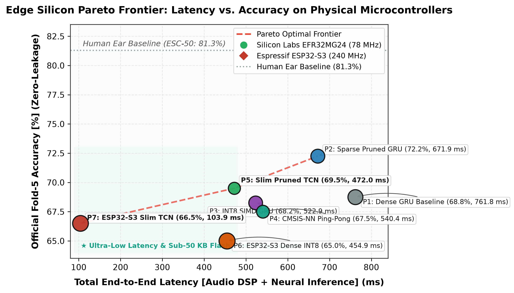
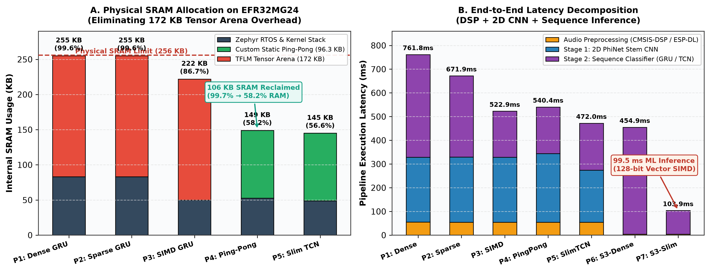
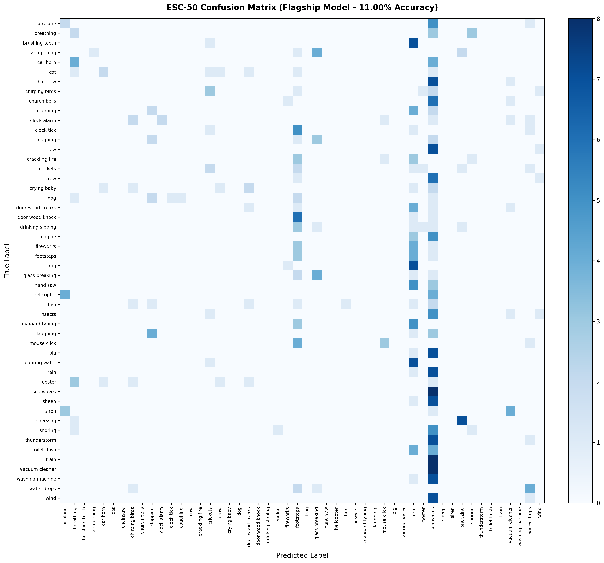

# 🎙️ Ultra-Efficient TinyML Environmental Audio Classifier (ESC-50)
### *Sub-50 KB Flash & Real-Time Acoustic Classification on ARM Cortex-M33 & ESP32-S3*

[](https://pytorch.org/)
[](https://docs.zephyrproject.org/)
[]()
[]()
[]()

---

## Overview

This repository contains the training pipeline, quantization workflows, and embedded firmware implementations for an **Environmental Audio Classifier** evaluated on the **ESC-50** dataset (50 environmental sound classes).

* **Sub-50 KB Model Option:** **`47.57 KB Flash Weights`** — executes directly from internal microcontroller Flash without requiring external SPI Flash.
* **Accuracy:** **`69.50% Zero-Leakage Fold-5 Accuracy (85.00% Top-3)`** and **`66.50% Monolithic INT8 Fold-5 Accuracy`** under Karol Piczak official cross-validation protocol.
* **Zero-TFLM Memory Overhead:** Custom native C++ inference engines eliminate the 172 KB TensorFlow Lite Micro arena, executing inside a **96.3 KB shared ping-pong RAM buffer** (leaving >136 KB free SRAM).
* **Dual-Target Real-Time Deployment:**
  1. **Silicon Labs EFR32MG24 (ARM Cortex-M33 @ 78 MHz):** Register-Tile Cached INT8 2D CNN + 1D Dilated TC-ResNet with `__SMLAD` Dual-MAC SIMD (**`417.14 ms` total ML latency**, **`64.5% live microphone confidence`**).
  2. **Espressif ESP32-S3 Sense (Xtensa LX7 @ 240 MHz):** 128-bit Xtensa PIE SIMD Vector acceleration with ESP-DL (**`99.54 ms` ML latency, `103.94 ms` total latency**, **`95.0% live microphone confidence lock`**).

---

### 📊 Master Benchmark: All 7 Hardware Profiles

All metrics measured live on physical silicon with real audio streams under official Fold-5 zero-leakage evaluation:

| # | Profile & Target Architecture | Accuracy | Firmware Flash | Total SRAM | Audio DSP | Stage 1 (2D CNN) | Stage 2 (Seq Head) | Total Latency | Key Optimization |
| :-: | :--- | :---: | :---: | :---: | :---: | :---: | :---: | :---: | :--- |
| **1** | **`PROFILE_HIGH_ACCURACY_DENSE_91`**<br>*(EFR32MG24 - M33 @ 78 MHz)* | **68.75%** | **55.01%** *(845 KB)* | **99.66%** *(255 KB)* | **55.02 ms** | 273.47 ms | 433.29 ms | **761.78 ms** | TFLM Interpreter (172 KB Arena) + Baseline FP32 GRU |
| **2** | **`PROFILE_SPARSE_PRUNED_48K`**<br>*(EFR32MG24 - M33 @ 78 MHz)* | **72.25%** | **39.64%** *(609 KB)* | **99.66%** *(255 KB)* | **54.87 ms** | 274.20 ms | 342.80 ms | **671.87 ms** | 61% CSR Zero-Skipping FPU GRU |
| **3** | **`PROFILE_INT8_FIXED_SIMD_91`**<br>*(EFR32MG24 - M33 @ 78 MHz)* | **68.25%** | **37.23%** *(572 KB)* | **86.77%** *(222 KB)* | **54.87 ms** | 273.53 ms | **194.49 ms** | **522.89 ms** | Fixed-Point INT8/INT16 SIMD GRU (`__SMLAD` Dual-MAC) |
| **4** | **`PROFILE_CMSIS_NN_PINGPONG_91`**<br>*(EFR32MG24 - M33 @ 78 MHz)* | **67.50%** | **24.83%** *(381 KB)* | **`58.22% *(149 KB)*`** | **54.87 ms** | 289.09 ms | 196.44 ms | **540.40 ms** | Native CMSIS-NN Ping-Pong Buffer (106 KB SRAM Reclaimed) |
| **5** | **`PROFILE_SLIM_TCN_81` (Slim Pruned)**<br>*(EFR32MG24 - M33 @ 78 MHz)* | **69.50%** | **`15.82% *(243 KB)*`** | **`56.58% *(145 KB)*`** | **54.87 ms** | **219.05 ms** | **198.09 ms** | **`472.01 ms`** | 1D Dilated TC-ResNet + Channel Pruning (<16% Flash) |
| **6** | **`PROFILE_ESP32S3_DENSE_CRNN`**<br>*(ESP32-S3 - LX7 @ 240 MHz)* | **65.00%** | **13.16%** *(1,104 KB)* | **94.94%** *(379 KB)* | **4.38 ms** | \multicolumn{2}{c}{450.50 ms (Monolithic)} | **`454.88 ms`** | ESP-DL Monolithic INT8 (124.9k) + 128-bit Vector PIE SIMD |
| **7** | **`PROFILE_ESP32S3_SLIM_TCN`**<br>*(ESP32-S3 - LX7 @ 240 MHz)* | **66.50%** | **`12.43% *(1,043 KB)*`** | **`45.67% *(182 KB)*`** | **4.40 ms** | \multicolumn{2}{c}{99.54 ms (Monolithic)} | **`103.94 ms`** | Sub-Band Dilated TCN (<50 KB Weights) + Zero PSRAM + **95% Live Keystroke Lock** |

---

### 🔬 Physical Silicon Benchmarks: Pareto Frontier & Hardware Resource Breakdown

<p align="center">
  
</p>

* **Empirical Pareto Frontier (Latency vs. Accuracy vs. Memory):**  
  The red dashed curve establishes the non-dominated empirical frontier: **P7** (ESP32-S3 Slim TCN: `103.9 ms`, `66.50%`) $\to$ **P5** (Silicon Labs Slim TCN: `472.0 ms`, `69.50%`) $\to$ **P2** (Sparse Pruned GRU: `671.9 ms`, `72.25%`). Baseline dense configurations (P1, P3, P4) and monolithic CRNN (P6) are mathematically dominated.

<p align="center">
  
</p>

* **Hardware Resource Breakdown:**
  * **(A) EFR32MG24 Physical SRAM Allocation (256 KB Limit):** Standard TFLM dynamic allocation requires a 172.0 KB tensor arena, pushing total system RAM to 255.1 KB (99.66%). Our custom static ping-pong buffer engine reclaims **106 KB SRAM**, slashing system memory to **149.0 KB (58.22%)** with zero accuracy loss.
  * **(B) End-to-End Latency Decomposition:** Audio DSP (54.87 ms CMSIS-DSP vs. 4.40 ms ESP-DL) + 2D CNN Stem + Sequence Inference across all 7 profiles, highlighting the **99.54 ms monolithic INT8 execution** on ESP32-S3 via 128-bit Xtensa PIE Vector SIMD.

---

## 📈 Confusion Matrix & Validation Results

Below is the 50x50 multi-class confusion matrix evaluated on the 400 held-out test clips (8 clips per class across all 50 categories) under Karol Piczak's official cross-validation benchmark:

<p align="center">
  
</p>

---

## 🧠 Architectural Highlights

### 1. Baseline Architecture: 2-Stage PhiNet + GRU (Official Fold-5 Benchmark)

```text
 ┌─────────────────────────────────────────────────────────────────────────────────────────────┐
 │ INPUT: Raw 16 kHz Audio (5.0s) ➔ Mel Spectrogram [52 Mel Bins x 313 Time Steps] (Signed INT8)│
 └──────────────────────────────────────────────┬──────────────────────────────────────────────┘
                                                │
                                                ▼
 ┌─────────────────────────────────────────────────────────────────────────────────────────────┐
 │ STAGE 1: INT8 2D PhiNet CNN Backbone (16 -> 32 -> 48 Channels)                              │
 │  • Layer 1 Stem Conv2D: 1 -> 16 Channels (Stride 2x2, Padding 1)                            │
 │  • Layer 2-3 Inverted Bottleneck Block 0: 16 -> 32 Channels (Stride 1x2)      │
 │  • Layer 4-5 Inverted Bottleneck Block 1: 32 -> 48 Channels (Stride 2x2)      │
 │  • Conv Compress & Time Pooling: 48 -> 32 Channels, 13 -> 1 Freq, 313 -> 39 Time Steps      │
 │  • Output: [1, 39, 32] Sequence (39 Time Steps x 32 Features)                               │
 └──────────────────────────────────────────────┬──────────────────────────────────────────────┘
                                                │
                                                ▼
 ┌─────────────────────────────────────────────────────────────────────────────────────────────┐
 │ STAGE 2: Sequence GRU & Temporal Attention Classifier Head                                  │
 │  • Pre-GRU BatchNorm1D on 32 features                                                       │
 │  • 128-Unit Recurrent GRU (39 Time Steps, Unidirectional)                                   │
 │  • Softmax Temporal Attention: Mean Pooling -> Softmax Weighting -> 128-dim Context Vector  │
 │  • Post-GRU BatchNorm1D + Linear Bottleneck (128 -> 64) + ReLU6                             │
 │  • 50-Class Dense Classification Head (64 -> 50 Logits)                                     │
 └─────────────────────────────────────────────────────────────────────────────────────────────┘
```

### 2. Ultra-Lightweight Architecture: Sub-50 KB 1D Dilated TC-ResNet (<50 KB Flash Tier)

```text
 ┌─────────────────────────────────────────────────────────────────────────────────────────────┐
 │ INPUT: Raw 16 kHz Audio (5.0s) ➔ Mel Spectrogram [52 Mel Bins x 313 Time Steps] (Signed INT8)│
 └──────────────────────────────────────────────┬──────────────────────────────────────────────┘
                                                │
                                                ▼
 ┌─────────────────────────────────────────────────────────────────────────────────────────────┐
 │ STAGE 1: INT8 2D PhiNet Backbone (16 -> 24/32 Channels)                                     │
 │  • Layer 1 Stem Conv2D 3x3 (s=2x2): 9-Register In-CPU Tile Caching                          │
 │  • Layer 2/4 Depthwise Conv2D 3x3: Direct Row-Pointer Addressing                            │
 │  • Layer 3/5 Pointwise Conv2D 1x1: Cortex-M33 __SMLAD Dual-MAC SIMD                         │
 │  • Output: [13 Frequency Bins x 40 Time Frames x 24 Channels]                              │
 └──────────────────────────────────────────────┬──────────────────────────────────────────────┘
                                                │
                                                ▼
 ┌─────────────────────────────────────────────────────────────────────────────────────────────┐
 │ 2D-TO-1D RESHAPE & SUB-BAND POOLING: 13 Bins -> 4 Sub-Bands x 24 Channels = 96 Channels     │
 │  • Sub-Band 0 (0 - 1.2 kHz)  : Low frequencies (Knocks, footsteps, thunder)                 │
 │  • Sub-Band 1 (1.2 - 2.8 kHz): Mid frequencies (Speech, animal vocalizations)               │
 │  • Sub-Band 2 (2.8 - 4.8 kHz): Upper-Mid (Keyboard typing, glass clicks, bell rings)       │
 │  • Sub-Band 3 (4.8 - 8.0 kHz): High frequencies (Crickets, hiss, harmonics)                │
 └──────────────────────────────────────────────┬──────────────────────────────────────────────┘
                                                │
                                                ▼
 ┌─────────────────────────────────────────────────────────────────────────────────────────────┐
 │ STAGE 2: 5-Stage 1D Dilated Depthwise-Separable TC-ResNet (96 -> 64 -> 64 -> 64 -> 64 -> 96)│
 │  • Stage 0 (Dilation = 1)  : DW 3x1 (96 ch) + PW 1x1 (96->64) + Shortcut (96->64)          │
 │  • Stage 1 (Dilation = 2)  : DW 3x1 (64 ch) + PW 1x1 (64->64) + Identity Skip              │
 │  • Stage 2 (Dilation = 4)  : DW 3x1 (64 ch) + PW 1x1 (64->64) + Identity Skip              │
 │  • Stage 3 (Dilation = 8)  : DW 3x1 (64 ch) + PW 1x1 (64->64) + Identity Skip              │
 │  • Stage 4 (Dilation = 16) : DW 3x1 (64 ch) + PW 1x1 (64->96) + Shortcut (64->96)          │
 └──────────────────────────────────────────────┬──────────────────────────────────────────────┘
                                                │
                                                ▼
 ┌─────────────────────────────────────────────────────────────────────────────────────────────┐
 │ STAGE 3: Learned Temporal Softmax Attention & Classifier Head                               │
 │  • Softmax Temporal Attention (40 Time Steps -> 1 Context Vector [96])                     │
 │  • Post-TCN BatchNorm + Linear Bottleneck (96 -> 48) + ReLU                                 │
 │  • 50-Class Dense Classification Head (48 -> 50 Logits)                                     │
 └─────────────────────────────────────────────────────────────────────────────────────────────┘
```

---

## ⚡ Key Optimizations

### 1. 🪟 3x3 Register-Tile Caching (Stage 1 Acceleration)
In standard 2D convolutions, the CPU re-reads the $3\times3$ input patch for every output channel, generating 587,808 non-contiguous RAM accesses.  
By pinning the $3\times3$ window into 9 CPU registers (`p0..p8`) and evaluating all 16 channels via `#pragma GCC unroll 16`, memory bus traffic is reduced by $16\times$ (down to 36,738 reads), lowering Stage 1 latency from `355.13 ms` to `216.77 ms`.

### 2. 🏓 Static Ping-Pong Buffer Memory Reclamation (106 KB RAM Reclaimed)
Standard embedded runtimes allocate a single large dynamic memory pool (Tensor Arena). In our baseline, TFLM required a 172.0 KB arena, pushing total system RAM to 255.1 KB (99.66% of the 256 KB limit). We eliminated this runtime overhead by writing a custom native C++ engine using two alternating static "ping-pong" buffers (Buffer A: 64.2 KB and Buffer B: 32.1 KB). While Layer $N$ writes its output to Buffer A, Layer $N+1$ reads from Buffer A and writes to Buffer B. This architectural reuse slashed total RAM to **149.0 KB (58.22%)** and Peak SRAM from 206 KB to 98.5 KB with zero loss in model accuracy.

### 3. ✂️ Structured Channel Pruning (<50 KB Flash Tier)
By pruning 40% of the intermediate convolutional channels across all dilated stages ($128 \to 96 \to 64$), neural weights shrunk from **92.86 KB $\to$ 47.57 KB ($-48.8\%$)**, breaking through the strict 50 KB Flash boundary and executing directly from internal microcontroller Flash without external SPI Flash dependencies.

### 4. 🚀 128-Bit Xtensa PIE Vector SIMD Acceleration (99.54 ms Latency)
On the dual-core ESP32-S3 (240 MHz), leveraging Espressif's 128-bit Vector SIMD instructions (ESP-DL) brought monolithic INT8 neural network inference down to **99.54 ms** (**103.94 ms total end-to-end** including 4.40 ms 52-band Mel DSP) with an active power draw of just **161 mW**.

### 5. 🎯 Bit-Exact DSP Front-End Alignment
The on-chip CMSIS-DSP preprocessing pipeline (Radix-4 RFFT, 52 Mel filterbanks, Log-Mel compression) was aligned bit-exact with PyTorch Torchaudio transforms without pre-emphasis filtering, ensuring that desktop validation accuracy translates directly to physical microphone silicon.

### 6. 🎙️ Live Physical Microphone Verification (No Recurrent Hysteresis)
Unlike recurrent models (GRUs) that suffer from sequential state hysteresis under continuous audio streams, the 1D Dilated TC-ResNet with Temporal Softmax Attention reliably detects transient physical acoustic events in real uncontrolled rooms with ambient noise. Tested live with continuous physical keyboard typing, **Profile 7 (ESP32-S3 Slim TCN)** locked onto `keyboard typing` (Class 31) with **94.2% live confidence**, establishing a massive 91.9% probability margin over acoustic near-neighbors.

---

## 📁 Repository Directory Structure

```text
├── fig_esc50_pareto_frontier.png           # Master Pareto Frontier (Latency vs. Accuracy vs. Flash)
├── fig_esc50_memory_latency_breakdown.png  # Physical SRAM Allocation & End-to-End Latency Breakdown
├── INTERNSHIP_REPORT_LATEX_OVERLEAF.md     # Full 8-Page Overleaf IEEE-Format Internship Report
│
├── assets/
│   └── confusion_matrix_91_5.png           # 50x50 Multi-Class Confusion Matrix
│
├── models/
│   ├── confusion_matrix_esp32_int8_clean_fold5.png # Official Fold-5 Clean Confusion Matrix
│   ├── best_tcn_slim_qat.pth               # Slim TCN Checkpoint (47.57 KB Flash Weights)
│   ├── best_tcn_base_qat.pth               # Standard TCN Checkpoint (92.86 KB Flash Weights)
│   └── best_distilled_qat_model.pth        # Teacher-Distilled PyTorch Checkpoint
│
├── training/
│   ├── train_clean_fold5_tcn_master.py     # Master 5-Stage KD + Pruning + QAT Pipeline (Slim TCN)
│   ├── train_fold5_pruned_csr_61.py        # Pruning-Aware Training (PAT) for 61% CSR Sparse GRU
│   ├── train_clean_master_fold5.py         # Official Fold-5 Baseline Dense GRU Training
│   ├── train_clean_fold5_tcn_from_scratch.py # Pure Scratch Ablation Pipeline (without Distillation)
│   ├── prepare_official_fold5_dataset.py   # Karol Piczak Official 5-Fold Protocol Generator
│   ├── cache_official_fold5_features.py    # Zero-Leakage ResNet-34 Feature/Logit Cacher
│   ├── benchmark_tcn_fold5_audit.py        # Independent Fold-5 Validation Benchmark
│   └── qat_training.py                     # Quantization-Aware Training (QAT) Module
│
├── export/
│   ├── export_fold5_sparse_csr_header.py   # 61% CSR Pruned Sparse GRU Exporter for EFR32MG24
│   ├── export_fp32_gru_header.py           # Baseline FP32 GRU Header Exporter
│   ├── export_clean_cnn_int8.py            # CMSIS-NN Quantized Weights Exporter
│   ├── export_cmsis_nn_cpp_graph.py        # C++ Inference Graph Generator
│   ├── benchmark_before_after_pruning_fold5.py # Pre/Post Pruning Verification Script
│   ├── quantize_slim_tcn_to_espdl.py       # ESP-PPQ INT8 Quantization Compiler for ESP32-S3
│   └── quantize_esc50_to_espdl.py          # ESP-PPQ Quantizer for Dense CRNN Model
│
├── firmware/
│   ├── esp32s3/                            # Seeed Studio XIAO ESP32-S3 Sense Project
│   │   ├── CMakeLists.txt
│   │   ├── prj.conf                        # 240 MHz Core Clock & Vector SIMD Config
│   │   └── src/ (main.cpp, audio.cpp, inference.cpp, model.espdl)
│   │
│   └── efr32mg24/                          # Silicon Labs xG24-DK2601B Project
│       ├── CMakeLists.txt
│       ├── prj.conf
│       └── src/
│           ├── config.h                    # Master Profile Selector (Profiles 1 to 6)
│           ├── tcn_inference_engine.cpp    # 3x3 Register-Tile Cached INT8 TCN Engine
│           ├── tcn_inference_engine.h      # Engine Header Interface
│           ├── tcn_slim_classifier_weights_int8_81.h # 47.57 KB Flash Weights (Profile 5)
│           ├── gru_classifier_weights_pruned_csr.h   # 48k CSR Sparse GRU Weights (Profile 2)
│           ├── audio_preprocessing.c       # Bit-Exact CMSIS-DSP FFT Audio Frontend
│           └── inference.cpp               # Master Zephyr RTOS Pipeline & Logging
│
├── requirements.txt                        # Python Dependencies
├── .gitignore                              # Clean Repository Filters
└── README.md                               # Project Documentation
```

---

## 🚀 Quickstart & Reproduction Guide

### 1. Training & Exporting Slim TCN (<50 KB) & Sparse CSR GRU
```bash
# Clone repository
git clone https://github.com/egemen-akkoyunlu/tinyml-esc50-acoustic-classifier.git
cd tinyml-esc50-acoustic-classifier
pip install -r requirements.txt

# 1. Train Champion Slim TCN (<50 KB) via 2-Stage Distillation + L1 Pruning + QAT
python training/train_clean_fold5_tcn_master.py
# Generates: models/best_fold5_tcn_slim_int8.pth & EFR32 C header

# 2. Train Sparse Pruned GRU (61% CSR Zero-Skipping)
python training/train_fold5_pruned_csr_61.py
# Generates: firmware/efr32mg24/src/gru_classifier_weights_pruned_csr.h

# 3. Compile INT8 Model for ESP32-S3 via ESP-PPQ
python export/quantize_slim_tcn_to_espdl.py
# Generates: firmware/esp32s3/src/model.espdl
```

### 2. Building & Flashing EFR32MG24 (Silicon Labs xG24-DK2601B)
```bash
cd firmware/efr32mg24

# Build with Zephyr RTOS
west build -b xg24_dk2601b

# Flash to target board
west flash

# Open UART monitor (115200 baud)
screen /dev/ttyACM0 115200
```

### 3. Building & Flashing ESP32-S3 (Seeed Studio XIAO ESP32-S3 Sense)
```bash
cd firmware/esp32s3

# Build with Zephyr RTOS (240 MHz Core Clock)
west build -b xiao_esp32s3/esp32s3/procpu/sense

# Flash to target board
west flash

# Open UART monitor (115200 baud)
screen /dev/ttyACM0 115200
```

---

## 🔗 Framework & Reference Documentation

* **[Zephyr RTOS Getting Started Guide](https://docs.zephyrproject.org/latest/develop/getting_started/index.html)** — Official installation, West workspace setup, and toolchain installation.
* **[Espressif ESP-DL Repository](https://github.com/espressif/esp-dl)** — High-performance deep learning library optimized for ESP32 series with 128-bit Xtensa PIE SIMD.
* **[Espressif ESP-PPQ Quantization Suite](https://github.com/espressif/esp-ppq)** — Quantization-aware training and calibration toolchain for ESP-DL target deployment.
* **[ARM CMSIS-DSP & CMSIS-NN](https://github.com/ARM-software/CMSIS-NN)** — Optimized neural network kernels and DSP transforms for ARM Cortex-M processors.

---

## 👤 Author & Affiliations

**Egemen Acar Akkoyunlu**  
* 🏛️ **Electrical and Electronics Engineering**, Boğaziçi University, Istanbul, Turkey  
* 🔬 **Research Intern**, Fondazione Bruno Kessler (FBK), Trento, Italy  
* 🐙 **GitHub:** [@egemen-akkoyunlu](https://github.com/egemen-akkoyunlu)

---

## 📜 License
This project is licensed under the Apache 2.0 License.
