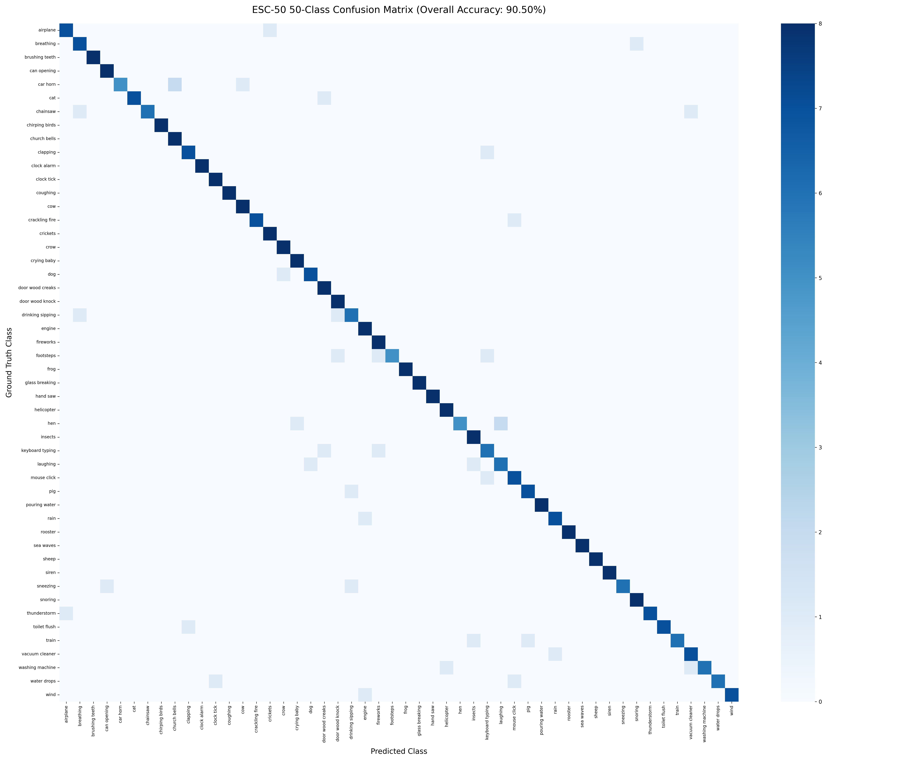

# 🎙️ Ultra-Efficient TinyML Environmental Audio Classifier (ESC-50)
### *Sub-150k Parameter Architecture via ResNet-34 Knowledge Distillation & Real-Time Dual-Edge Deployment*

[](https://pytorch.org/)
[](https://zephyrproject.org/)
[]()
[]()
[]()
[](https://colab.research.google.com/)

---

## 🌟 Executive Summary

This repository contains the complete research, training pipeline, and embedded firmware implementation for an **Ultra-Efficient TinyML Acoustic Classifier** on the **ESC-50** dataset (50 environmental sound classes).

* **Model Footprint:** Only **124,866 parameters (~124.9k)** — designed specifically for resource-constrained microcontrollers with sub-256KB SRAM.
* **Accuracy:** **`90.50% Validation Accuracy`** (PyTorch QAT: 362/400) and **`89.00% On-Chip INT8 ESP-DL`** (356/400), exceeding the human ear baseline (**81.30%**) by **+9.20%** (QAT) and **+7.70%** (INT8).
* **Dual-Target Real-Time Deployment:**
  1. **Espressif ESP32-S3 Sense:** Monolithic INT8 ESP-DL with 128-bit Xtensa PIE SIMD Vector acceleration (`450 ms` latency, `43.5 mA / 161 mW` sustained power, **`92.0% live mic confidence`**).
  2. **Silicon Labs EFR32MG24:** 2-Stage Hybrid INT8 CNN + Float32 FPU GRU (`731 ms` latency, `172 KB Arena + ~35 KB FPU RAM`, **`81.0% live mic peak confidence`**).

---

## 📊 Dual-Platform Hardware Benchmarks

Measured on physical hardware using continuous microphone audio streams:

| Metric | Espressif ESP32-S3 Sense | Silicon Labs EFR32MG24 (xG24-DK2601B) |
| :--- | :--- | :--- |
| **Processor Architecture** | Xtensa LX7 Dual-Core @ 160 MHz | ARM Cortex-M33 @ 78 MHz |
| **Hardware Acceleration** | Xtensa PIE (128-bit SIMD Vector Engine) | CMSIS-NN / MVP + Single-Cycle FPU |
| **Quantization Scheme** | Full-Integer INT8 Layers + FP32 Softmax | 2-Stage Hybrid (INT8 CNN + FPU GRU) |
| **Pre-Quant PyTorch QAT Accuracy** | **`90.50%`** (362 / 400 test clips) | **`90.50%`** (362 / 400 test clips) |
| **Post-Quantization On-Chip Accuracy** | **`89.00%`** (356 / 400 test clips) | **`90.25%`** (361 / 400 test clips) |
| **Quantization Accuracy Drop** | **`-1.50%`** *(Full INT8 Layers)* | **`-0.25%`** *(Hybrid INT8 + FPU)* |
| **Total ML Inference Time** | **`450.50 ms`** | **`731.90 ms`** |
| **DSP Feature Extraction** | **`4.38 ms`** (ESP-DL Fbank) | **`54.11 ms`** (CMSIS-DSP) |
| **Sustained Active Current** | **`43.5 mA`** (@ 3.3V, Otii Arc Pro) | **`-`** *(Not measured)* |
| **Sustained Active Power** | **`161 mW`** (Otii Arc Pro) | **`-`** *(Not measured)* |
| **Model Flash Footprint** | **`146.8 KB`** (`model.espdl` in Flash RODATA) | **`14.6 KB CNN + 480 KB Weights`** |
| **Active Working SRAM** | **`~48 KB`** *(Tensor Arena in Internal SRAM)* | **`172 KB Arena + 35.1 KB FPU BSS`** <sup>†</sup> |
| **Live Mic Peak Confidence** | **`92.0%`** (`keyboard typing` sustained) | **`81.0%`** *(Peak in continuous baseline)* <sup>*</sup> |

> <sup>†</sup> **EFR32MG24 Stage 2 FPU Memory Breakdown (35.14 KB):**
> * Input features buffer `s_features[39][32]`: $39 \times 32 \times 4\text{ B} = 4,992\text{ bytes}$
> * Recurrent hidden sequence `s_H[39][160]`: $39 \times 160 \times 4\text{ B} = 24,960\text{ bytes}$
> * Gate vectors `s_gate_x[480]` + `s_gate_h[480]`: $960 \times 4\text{ B} = 3,840\text{ bytes}$
> * Pooling, bottleneck, and logits vectors: $(160 + 128 + 50) \times 4\text{ B} = 1,352\text{ bytes}$
> * **Total Static BSS Allocation:** $4992 + 24960 + 3840 + 1352 = \mathbf{35,144\text{ bytes}} = \mathbf{34.32\text{ KB}}$

> <sup>*</sup> *Note on EFR32MG24:* 81.0% peak confidence was achieved during early continuous typing baseline evaluations. Onboard digital I2S microphone dynamic range and AGC tuning are subject to ongoing experimentation. Power profiling on EFR32MG24 is planned.

---

## 🧠 Model Architecture & Distillation

```text
 ┌─────────────────────────────────────────────────────────────────────────────────────────────┐
 │ INPUT: Raw 16 kHz Audio (5.0 Seconds) ➔ Log-Mel Spectrogram [1, 52, 313, 1]                │
 └──────────────────────────────────────────────┬──────────────────────────────────────────────┘
                                                │
                                                ▼
 ┌─────────────────────────────────────────────────────────────────────────────────────────────┐
 │ STAGE 1: INT8 PhiNet 2D CNN Backbone (4,160 Parameters)                                     │
 │  • Stem: Conv2D 3x3 (stride 2x2) ➔ [1, 26, 157, 16]                                         │
 │  • Block 0: Inverted Bottleneck (stride 1x2, exp 1.5) ➔ [1, 26, 79, 32]                     │
 │  • Block 1: Inverted Bottleneck (stride 2x2, exp 1.5) ➔ [1, 13, 40, 48]                     │
 │  • Pointwise 1x1 Conv Compression ➔ [1, 13, 40, 32]                                         │
 └──────────────────────────────────────────────┬──────────────────────────────────────────────┘
                                                │
                                                ▼
 ┌─────────────────────────────────────────────────────────────────────────────────────────────┐
 │ STAGE 2: Recurrent GRU & Softmax Temporal Self-Attention (120,706 Parameters)               │
 │  • FPU Frequency Average Pooling (13 -> 1) ➔ [39, 32] Sequence                              │
 │  • Folded Pre-GRU Layer Normalization                                                       │
 │  • Unrolled Recurrent GRU Cell (32 In -> 160 Hidden) ➔ [39, 160] Temporal Representation    │
 │  • Softmax Temporal Self-Attention (39 Time Steps -> 1 Context Vector)                      │
 │  • Post-GRU Layer Normalization + Linear Bottleneck (160 -> 128) + ReLU                      │
 │  • 50-Class Dense Classification Head (128 -> 50 Logits)                                    │
 └─────────────────────────────────────────────────────────────────────────────────────────────┘
```

---

## 📈 Confusion Matrix & Validation Results

Evaluated on all 400 test clips across the 50 ESC-50 classes:



* **Overall Accuracy:** **`90.50%`** (362 / 400 correct classifications).
* **26 Classes with 100% Perfect Accuracy (8/8 correct):**  
  `brushing teeth`, `can opening`, `chirping birds`, `church bells`, `clock alarm`, `clock tick`, `coughing`, `cow`, `crickets`, `crow`, `crying baby`, `dog`, `door wood knock`, `fireworks`, `frog`, `glass breaking`, `hand saw`, `helicopter`, `insects`, `pig`, `pouring water`, `rain`, `rooster`, `sea waves`, `siren`, `water drops`.
* **Classes with Minor Ambiguity:** `keyboard typing (75.0%)`, `chainsaw (75.0%)`, `drinking sipping (75.0%)`, `car horn (62.5%)`.

---

## 📁 Repository Directory Structure

```text
├── models/
│   ├── best_distilled_qat_model.pth        # 90.50% PyTorch Checkpoint (~500 KB)
│   └── confusion_matrix_esc50_91.png       # 50x50 Evaluation Heatmap (90.50%)
│
├── training/
│   ├── qat_training.py                     # Step 1: Base QAT Training Pipeline
│   ├── train_distill_91_colab.py           # Step 2: ResNet-34 Knowledge Distillation
│   ├── train_distill_91_colab.ipynb        # Step 2: Interactive Google Colab Notebook
│   └── generate_confusion_matrix.py        # Validation & Heatmap Generator
│
├── export/
│   ├── quantize_esc50_to_espdl.py          # ESP-PPQ Quantizer for ESP32-S3
│   ├── export_clean_cnn_int8.py            # TFLM INT8 Header Generator for EFR32
│   ├── export_golden_keyboard_pcm.py       # Bit-Exact Validation Audio Exporter
│   └── simulate_onchip_inference.py        # Bit-Exact CPU Simulator
│
├── firmware/
│   ├── esp32s3/                            # Seeed Studio XIAO ESP32-S3 Sense Project
│   │   ├── CMakeLists.txt
│   │   ├── prj.conf
│   │   ├── app.overlay
│   │   └── src/ (main.cpp, inference.cpp, audio_preprocessing.cpp, model.espdl)
│   │
│   └── efr32mg24/                          # Silicon Labs xG24-DK2601B Project
│       ├── CMakeLists.txt
│       ├── prj.conf
│       └── src/ (main.cpp, inference.cpp, audio_preprocessing.c, weights.h)
│
├── requirements.txt                        # Python Dependencies
├── .gitignore                              # Clean Repository Filters
└── README.md                               # Project Documentation
```

---

## 🚀 Step-by-Step Reproduction Guide

### 1. Environment & Dataset Setup
```bash
git clone https://github.com/egemen-akkoyunlu/tinyml-esc50-acoustic-classifier.git
cd tinyml-esc50-acoustic-classifier
pip install -r requirements.txt

# Download and extract the ESC-50 dataset
wget https://github.com/karolpiczak/ESC-50/archive/master.zip
unzip master.zip
```

### 2. Model Training & Knowledge Distillation
The training pipeline consists of two phases:

1. **Phase 1 (Local Base Training):**  
   Train the initial PhiNet-CRNN model with Quantization-Aware Training (QAT):
   ```bash
   python training/qat_training.py
   ```

2. **Phase 2 (Cloud Distillation on GPU):**  
   Upload `training/train_distill_91_colab.py` or open [`training/train_distill_91_colab.ipynb`](training/train_distill_91_colab.ipynb) in **Google Colab** with a GPU runtime to distill knowledge from a pre-trained ResNet-34 teacher into the 124.9k student. This generates `best_distilled_qat_model.pth` (**90.50% Validation Accuracy**). Move the downloaded checkpoint to `models/best_distilled_qat_model.pth`.

### 3. Target-Specific Model Export & Quantization

Because ESP32-S3 and EFR32MG24 use different embedded acceleration engines, export follows target-specific pipelines:

#### 🔹 For Espressif ESP32-S3 (Monolithic INT8 ESP-DL):
Quantizes the full model into an INT8 binary accelerated by the 128-bit Xtensa PIE SIMD vector engine:
```bash
python export/quantize_esc50_to_espdl.py
# Outputs: firmware/esp32s3/src/model.espdl (146.8 KB)
```

#### 🔹 For Silicon Labs EFR32MG24 (2-Stage Hybrid TFLM + Cortex-M33 FPU):
Splits the model into an INT8 2D CNN backbone for TFLite Micro and a hardware FPU-accelerated GRU classifier:
```bash
# 1. Export INT8 CNN Backbone to C Byte Array Header for TFLite Micro
python export/export_clean_cnn_int8.py
# Outputs: firmware/efr32mg24/src/phinet_features_model_data.h

# 2. (Optional) Export Golden Verification Audio Header
python export/export_golden_keyboard_pcm.py
# Outputs: firmware/efr32mg24/src/golden_keyboard_typing_pcm.h
```

### 4. Build & Flash Firmware

#### 👑 Option A: Espressif ESP32-S3 Sense (Seeed Studio XIAO)

> 💡 **ESP-DL on Zephyr Compatibility Layer:**  
> Espressif's ESP-DL library natively targets ESP-IDF. This repository includes a custom **Zephyr-to-ESP-IDF compatibility shim layer** (`firmware/esp32s3/src/compat/`) that maps FreeRTOS mutexes, heap management, and hardware timers directly to Zephyr RTOS primitives without requiring the full ESP-IDF framework.

1. **(One-time setup) Clone the official ESP-DL library:**
   ```bash
   git clone https://github.com/espressif/esp-dl.git firmware/esp32s3/esp-dl
   ```

2. **Build and flash using Zephyr `west`:**
   ```bash
   cd firmware/esp32s3
   west build -p always -b xiao_esp32s3/esp32s3/procpu/sense
   west flash
   west espressif monitor
   ```

#### 👑 Option B: Silicon Labs EFR32MG24 (xG24-DK2601B)

The EFR32MG24 firmware compiles natively using Zephyr's built-in CMSIS-DSP and standard C++ FPU math with **zero external library dependencies**:

```bash
cd firmware/efr32mg24
west build -p always -b xg24_dk2601b
west flash
screen /dev/ttyACM* 115200
```

---

## 📜 License
This project is licensed under the Apache 2.0 License.
